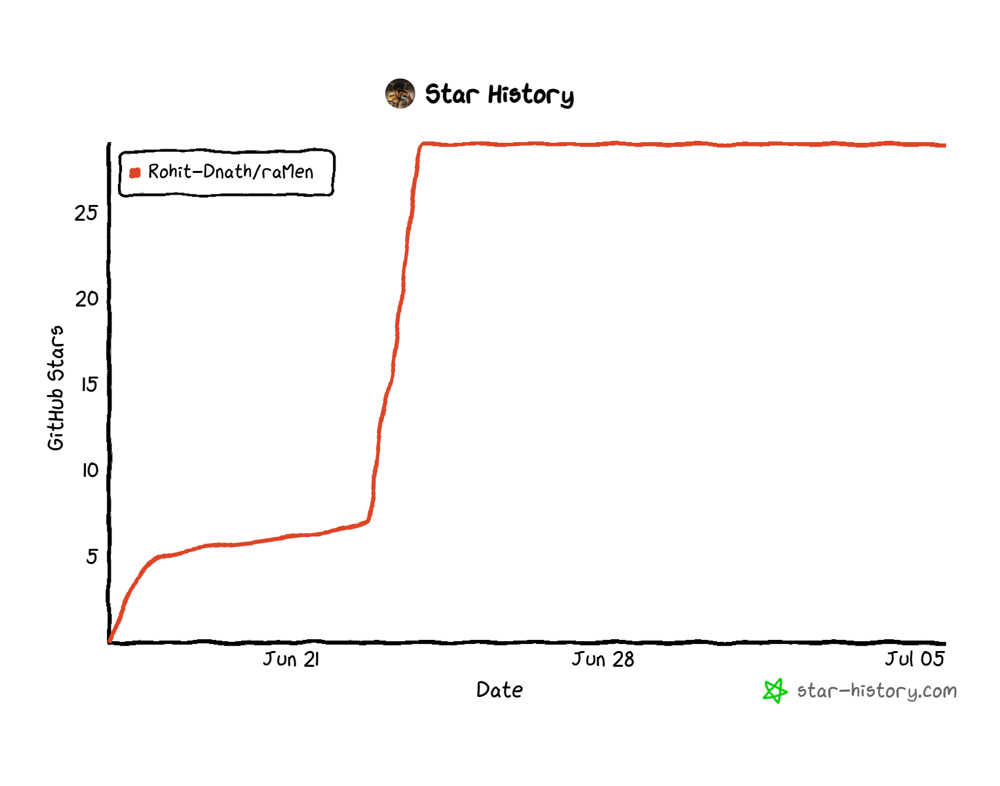

<p align="center">
  
</p>

<h1 align="center">Cache-Pot</h1>

<p align="center"><b>RAM + cache-pot. In memory, and fast to spin up.</b></p>

<p align="center">
  <a href="https://github.com/subh05sus/cache-pot/actions/workflows/ci.yml"></a>
  
  
  
  <a href="https://wise.com/pay/me/subhadips25"></a>
</p>

<p align="center">
  <a href="https://github.com/subh05sus/cache-pot/stargazers"></a>
  <a href="https://github.com/subh05sus/cache-pot/labels/good%20first%20issue"></a>
  <a href="https://github.com/subh05sus/cache-pot/issues"></a>
  <a href="https://github.com/subh05sus/cache-pot/graphs/contributors"></a>
  <a href="CONTRIBUTING.md"></a>
</p>

Cache-Pot is a fast in-memory data store, like Redis, but built for AI apps and AI agents.

It does three things:

1. It works as a drop-in cache. It speaks the same protocol as Redis, so your existing Redis client and code keep working with no changes.
2. It can store and search vectors, and it can cache AI answers by meaning. So if two prompts mean the same thing, Cache-Pot can return the saved answer instead of calling the model again. That saves you money.
3. It has a built-in MCP server. That means AI agents (like Claude) can read, write, search, and remember data in Cache-Pot directly as a tool. No extra glue code needed.

> Redis was built for app servers. Cache-Pot is built for AI agents.

## Is this a Redis alternative?

Yes, for a lot of common use cases. If you use Redis (or Valkey) as a cache or a simple key value store, you can point your app at Cache-Pot instead and it will just work, because Cache-Pot speaks the Redis protocol (RESP2).

Where Cache-Pot is different:

- It has vector search and a semantic cache built in. With Redis you would need an extra module or extra code for that.
- It has an MCP server built in, so AI agents can use it as a tool out of the box.
- It is one small single file (a single binary) with no extra dependencies. Easy to download and run.

What Cache-Pot does NOT do yet (so you know what you are getting):

- No clustering, no replication, no failover.
- No append-only-file durability (it saves snapshots to disk instead).
- Not tuned to beat Redis or Valkey on raw speed.

So: great as a Redis-style cache and an AI data layer for one machine. Not yet a replacement for a big production Redis cluster.

## Quick start (the simple version)

You need [Go](https://go.dev/dl/) installed (version 1.25 or newer). Then run one of these.

### Option 1: install with Go

```bash
go install github.com/subh05sus/cache-pot/cmd/cache-pot@latest
cache-pot
```

### Option 2: run with Docker

```bash
docker run -p 6379:6379 -p 8080:8080 ghcr.io/subh05sus/cache-pot:latest
```

### Option 3: build from source

```bash
git clone https://github.com/subh05sus/cache-pot
cd Cache-Pot
go run ./cmd/cache-pot
```

When it starts you will see:

```
cache-pot: listening on [::]:6379
cache-pot: dashboard on http://localhost:8080
```

That is it. Cache-Pot is now running on port 6379, and a live dashboard is at http://localhost:8080.

## How to use it

### Talk to it like Redis

If you have `redis-cli` installed, just connect to port 6379:

```bash
redis-cli -p 6379
```

```
> SET hello world
OK
> GET hello
"world"
> EXPIRE hello 60
(integer) 1
```

If you have an app that already uses Redis, point it at Cache-Pot. Usually you only change one setting:

```bash
export REDIS_URL=redis://localhost:6379
```

### Basic commands

These work just like Redis:

```
SET user:1 "Subh"          store a value
GET user:1                  read it back
INCR visits                 count something
HSET person name Subh      store fields under one key
RPUSH queue job1 job2       a list
SADD tags go ai             a set
ZADD board 100 alice        a ranked list
SUBSCRIBE news              listen for messages
PUBLISH news "hello"        send a message
```

Full list with examples: [docs/commands.md](docs/commands.md).

### Vector search

Store vectors and find the closest ones. Your app gives Cache-Pot the numbers, no API key needed.

```
VSET docs d1 0.1 0.2 0.9 META "intro page"
VSET docs d2 0.9 0.1 0.0 META "pricing page"
VSEARCH docs 0.1 0.2 0.85 TOPK 1 WITHSCORES
```

### Semantic cache (save money on AI calls)

Cache an AI answer once. Next time a similar question comes in, get the saved answer back instead of paying for another model call.

```
SCACHE.SET "What is the capital of France?" "Paris"
SCACHE.GET "whats the capital of france" THRESHOLD 0.9
> "Paris"
```

This needs an embeddings provider. It works with a free local [Ollama](https://ollama.com) or with OpenAI. See [Configuration](#configuration).

### Agent memory

Let an AI agent remember things across turns:

```
REMEMBER session7 user_name Subh
RECALL session7 user_name
> "Subh"
```

### Use it from Claude (MCP)

Start Cache-Pot, then add this to your Claude config and Claude can use Cache-Pot as a tool:

```json
{
  "mcpServers": {
    "cache-pot": {
      "command": "cache-pot",
      "args": ["mcp", "--addr", "localhost:6379"]
    }
  }
}
```

Step by step guide: [docs/mcp.md](docs/mcp.md).

### The dashboard

Open http://localhost:8080 in your browser while Cache-Pot is running. You will see your keys, memory use, and the cache hit rate, updating live. Turn it off with `--dashboard-addr ""`.

## Cache-Pot vs Redis vs Valkey

| | Cache-Pot | Redis | Valkey |
|---|---|---|---|
| Redis protocol (RESP2) | Yes | Yes | Yes |
| Works with existing Redis clients | Yes (common commands) | Yes | Yes |
| One single binary, no setup | Yes | No | No |
| Vector search built in | Yes | Needs a module | Needs a module |
| Semantic cache command | Yes | No | No |
| MCP server for AI agents | Yes | No | No |
| Clustering and replication | Not yet | Yes | Yes |
| Best raw speed on one node | Good | Best | Best |
| License | BSD-3-Clause | AGPL / RSAL (since 2024) | BSD-3-Clause |

## Configuration

Every flag also has a `CACHEPOT_*` environment variable.

| Flag | Env var | Default | What it does |
|---|---|---|---|
| `--addr` | `CACHEPOT_ADDR` | `:6379` | Port to listen on |
| `--auth` | `CACHEPOT_AUTH` | empty | Require a password (empty means no password) |
| `--snapshot-path` | `CACHEPOT_SNAPSHOT_PATH` | `cache-pot.snapshot` | Where to save data (empty turns saving off) |
| `--snapshot-interval` | `CACHEPOT_SNAPSHOT_INTERVAL` | `60s` | How often to save to disk |
| `--dashboard-addr` | `CACHEPOT_DASHBOARD_ADDR` | `:8080` | Dashboard port (empty turns it off) |
| `CACHEPOT_EMBED_URL` | `CACHEPOT_EMBED_URL` | empty | Embeddings endpoint for the semantic cache |
| `CACHEPOT_EMBED_MODEL` | `CACHEPOT_EMBED_MODEL` | `text-embedding-3-small` | Which embedding model to use |
| `CACHEPOT_EMBED_KEY` | `CACHEPOT_EMBED_KEY` | empty | API key for the embeddings endpoint |

Turn on the semantic cache for free with a local Ollama:

```bash
ollama pull nomic-embed-text
export CACHEPOT_EMBED_URL=http://localhost:11434/v1/embeddings
export CACHEPOT_EMBED_MODEL=nomic-embed-text
cache-pot
```

Or use OpenAI:

```bash
export CACHEPOT_EMBED_URL=https://api.openai.com/v1/embeddings
export CACHEPOT_EMBED_MODEL=text-embedding-3-small
export CACHEPOT_EMBED_KEY=sk-your-key
cache-pot
```

## Roadmap

- Done: core Redis commands, strings, hashes, lists, sets, sorted sets, expiry, pub/sub, snapshot saving.
- Done: vector store, semantic cache, agent memory, MCP server, dashboard.
- Next: replication, stronger durability, clustering, faster vector index (HNSW).

## Support the project

Cache-Pot is free and open source, and it always will be. If it saves you time or you would like to help fund its development, you can support the work directly. It genuinely helps keep the project moving.

<p align="center">
  <a href="https://wise.com/pay/me/subhadips25">
    
  </a>
</p>

Not in a position to chip in? A star, a share, or a bug report helps just as much. Thank you.

## Contributing

Cache-Pot is open source and very new, which means this is a great time to get involved and make a real difference. Beginners are welcome. You do not need to be a Go expert.

Good first things to help with:

- Try it out and report bugs or confusing parts.
- Improve the docs or add examples.
- Add a missing Redis command.
- Test Cache-Pot with your favourite Redis client and tell us what worked.

### Good first issues

New here? These are small, self-contained, and well described. Pick one, comment to claim it, and you are off.

- [**Good first issues**](https://github.com/subh05sus/cache-pot/labels/good%20first%20issue) beginner-friendly, clearly scoped tasks.
- [**Help wanted**](https://github.com/subh05sus/cache-pot/labels/help%20wanted) things we would love a hand with.
- [**All open issues**](https://github.com/subh05sus/cache-pot/issues) the full list.

Most open issues are missing Redis commands with the exact files and acceptance criteria already written down, so you can follow an existing handler as a template and open a PR the same day.

Then read the [Contributing Guide](CONTRIBUTING.md) to get started. If you are not sure where to begin, open an issue and say hi. Stars and shares also help a lot.

## Star History

<p align="center">
  <a href="https://www.star-history.com/#subh05sus/cache-pot&Date">
    
  </a>
</p>

## License

[BSD-3-Clause](LICENSE). This is the same license family Redis used before 2024, and the one Valkey uses. Simple and permissive, no surprises.
